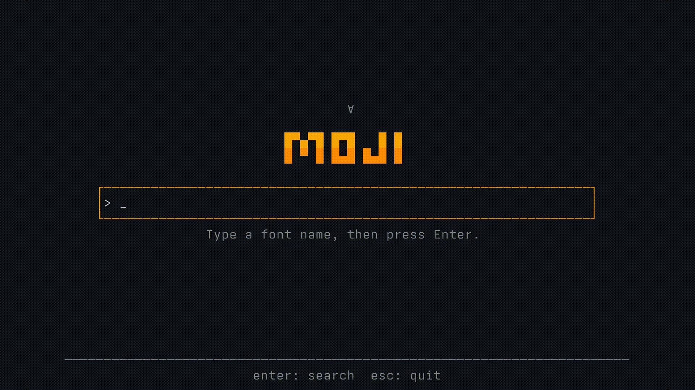

<div align="center">


<h1>moji</h1>

<p>
  <a href="https://www.npmjs.com/package/@microck/moji"></a>
  
  <a href="https://github.com/Microck/moji/actions/workflows/ci.yml"></a>
  <a href="LICENSE"></a>
</p>

<a href="docs/public/moji-tui-demo-1080p.mp4">
  
</a>

</div>

---

ask for a font and get the file you actually meant. `moji` searches across font
sources, ranks candidates by family and filename, and downloads the best match.
browse interactively with Bubble Tea, pipe a stable table into shell workflows,
or request JSON for programmatic use.

## quick start

install with the package manager you already use:

```bash
npm install -g @microck/moji
pnpm add -g @microck/moji
bun add -g @microck/moji
```

search for a family:

```bash
moji
# or jump straight to results
moji "Futura"
```

bare `moji` opens the home TUI so you can type a query. pass a query to jump
straight to the live result list. redirect or pipe a queried command to get a
stable table instead.

```bash
moji "Futura" --format otf,ttf
moji "Futura" --format woff2 --json
```

download the best match, preview the choice first, or ask for the whole family:

```bash
moji get "Futura bold" --dry-run
moji get "Futura bold"
moji get "Futura entire family" --download-dir ~/Downloads/moji
```

## providers

the default GetFonts and registry providers work without an account. GitHub's
repository, tree, and release search also uses its small unauthenticated
allowance. Moji automatically uses an existing authenticated `gh` session when
GitHub CLI is installed. `GITHUB_TOKEN` and `github_token` take precedence and
also enable Code Search and higher limits. the TUI points this out when GitHub
search is limited.

the `websearch` provider automatically uses
[`kagi-cli`](https://github.com/Microck/kagi-cli) when it is installed. Run
`kagi auth` once. Ordinary web pages are ignored. direct CSS font URLs and
bounded ZIP or TAR archive members can become results. configured source
plugins pass through the same HTTPS, format, and download validation boundary.
Direct binary responses with missing or misleading extensions can also be
recognized as ZIP, TAR, or compressed TAR archives by signature; webpages and
interactive download flows remain excluded.

```bash
export GITHUB_TOKEN=github_pat_example
moji "Futura" --provider github
```

do not pass tokens as command-line flags. use `--token-stdin` when a token only
needs to exist for one invocation.

the same `websearch` provider also uses SearXNG when an instance URL is
configured.

## commands

| command | purpose |
| --- | --- |
| `moji` | open the home TUI and type a font query |
| `moji <query>` | search interactively or print a table when piped |
| `moji get <query>` | rank results and download the best match |
| `moji config` | create the default config when needed and open `$EDITOR` |
| `moji config show` | print the current config with its token redacted |
| `moji cache clear` | remove cached provider results |

run `moji --help` for the complete flag and example reference.

## download safety

downloads use HTTPS by default and stop at 50 MiB. before the final file appears,
`moji` validates its font magic bytes, sanitizes its filename, writes to a
temporary path, and renames it atomically. SHA-256 hashes prevent duplicate
files from being saved twice.

If the first ranked link returns invalid font bytes, `moji get` remembers that
URL and tries the next candidate. Whole-family downloads validate one coherent
same-source group in staging, so a broken member cannot leave a partial family
or mix sources.

search results include source and best-effort license metadata. an `unknown`
license is not permission to use or redistribute a font. check the font's
license before shipping it.

## configuration

the default config lives at `~/.moji/config.yaml` and is written with mode
`0600`. set `MOJI_CONFIG` to use a different file.

```yaml
download_dir: ~/Downloads/moji
search_timeout_seconds: 15
cache_ttl_seconds: 3600
default_formats: [otf, ttf, woff2, dfont, pfb, pfm]
source_plugins: []

providers:
  github:
    enabled: true
  getfonts:
    enabled: true
  registry:
    enabled: true
  websearch:
    enabled: true
    instance: ""
```

## documentation

the Fumadocs site covers the complete workflow:

- [start here](docs/content/docs/index.mdx)
- [tutorial](docs/content/docs/tutorial.mdx)
- [CLI reference](docs/content/docs/reference/cli.mdx)
- [configuration reference](docs/content/docs/reference/configuration.mdx)
- [providers](docs/content/docs/reference/providers.mdx)
- [errors and exit codes](docs/content/docs/reference/errors-and-exit-codes.mdx)
- [architecture](docs/content/docs/explanation/architecture.mdx)

the original product and architecture research remains in
[`research/cli-design.md`](research/cli-design.md).

## development

verify the Go CLI and production documentation build together:

```bash
npm install
npm run verify
```

run the parts independently when working on one side of the repository:

```bash
make verify
npm run docs:check
npm run docs:build
npm run docs:dev
```

Before a release, `npm run release` rebuilds and verifies the exact npm archive
without publishing it. The operator-only `npm run release:publish` runs the
same gate before npm publication, the annotated tag, and the GitHub release.
See the [release runbook](docs/release-runbook.md).

the end-to-end suite builds the real binary, searches a controlled HTTP
provider, downloads a valid fixture font, checks the file on disk, and exercises
cache clearing.

## license

[MIT](LICENSE)
