Moji uses separate pipelines for remote discovery and local conversion:

```mermaid
---
title: Moji operation pipelines
---
flowchart TB
  accTitle: Remote discovery and local conversion pipelines
  accDescr: Search queries pass through providers, aggregation, ranking, presentation, and validated download. Local fonts pass through format detection, WOFF2 encoding or decoding, output validation, and an atomic file commit.

  subgraph remote["Remote search and download"]
    direction LR
    query["Font query"] -->|fans out to| providers["Enabled providers"]
    providers -->|emit typed events| aggregate["Aggregation and cache"]
    aggregate -->|feeds| rank["Normalization, grouping, and ranking"]
    rank -->|presents through| interface["TUI, table, JSON, or get"]
    interface -->|selects result for| download["Validated download"]
  end

  subgraph local["Local conversion"]
    direction LR
    input["Local TTF, OTF, or WOFF2"] -->|inspect bytes| detect["Content-based format detection"]
    detect -->|choose codec operation| codec["WOFF2 encode or decode"]
    codec -->|check output| validate["Output validation"]
    validate -->|commit safely| commit["Atomic no-replace file commit"]
  end
```

Conversion does not enter provider discovery, aggregation, ranking, cache,
download, or TUI code.

## Providers own external contracts

Each provider implements the same interface but owns its request format,
response parsing, and source-specific errors. GitHub, GetFonts, and SearXNG
live in separate modules so changes to one external contract do not tangle the
others.

Providers emit:

- result events containing a normalized `Result` record;
- searching and done status;
- throttled status with an optional retry delay; and
- failed status with a typed cause.

## Aggregation owns concurrency and resilience

The aggregator starts one worker per selected provider. It forwards events as
they arrive, applies timeout and retry policies, respects provider retry
delays, and isolates provider panics.

This boundary enables partial success. A failed provider does not invalidate a
result already returned by another source.

## Ranking owns font interpretation

The ranking package converts filename conventions into a family, weight,
format, and style. It also owns weight filtering and family selection. The CLI
and TUI use the same functions instead of implementing their own filename
rules.

## Interfaces own presentation

The app package chooses the interface:

- real stdin and stdout terminals receive the live Bubble Tea interface;
- redirected output receives a stable table;
- `--json` receives structured results; and
- `get` performs non-interactive selection and optional download; and
- `convert` performs non-interactive local font conversion without opening the
  TUI or loading provider configuration.

Provider failure descriptions and result identity are shared domain rules, so
all interfaces present consistent outcomes.

## Downloads own file safety

The download package is the only path that turns a remote result into a final
file. It validates the transport, content, and destination before an atomic
rename. Presentation layers only choose a result and report the outcome.

## Conversion owns local font transformation

The font conversion package detects supported containers from their bytes,
not their filenames. It wraps the WOFF2 codec and permits only container
changes that preserve the font's TrueType or CFF outline technology.

Conversion and downloads share the same cross-platform no-replace commit
primitive. Both expose a completed temporary file atomically and refuse to
replace a path created by another process.
